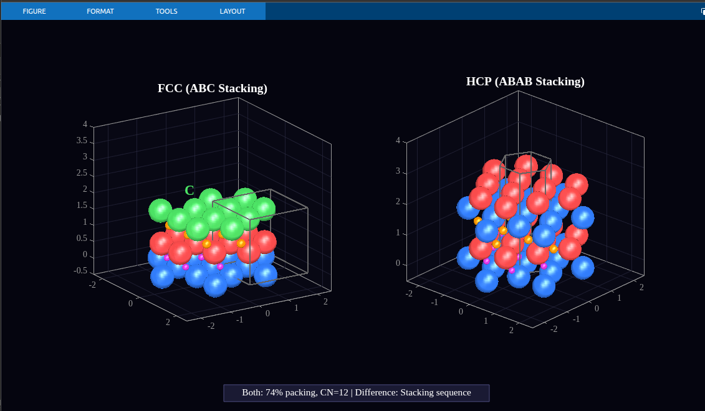
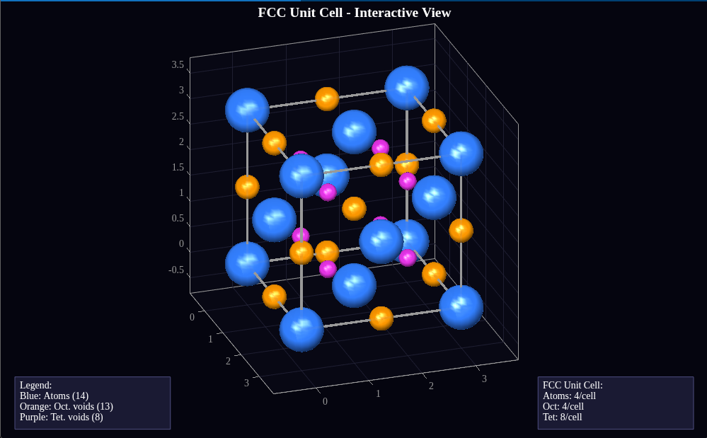
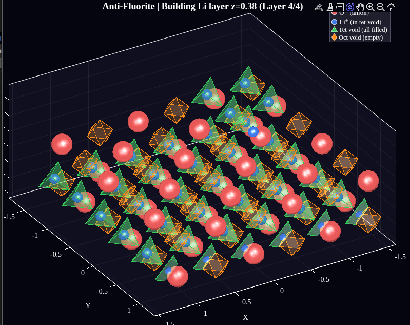
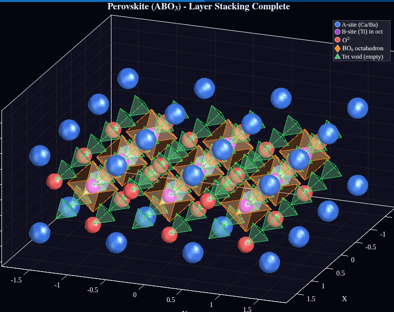
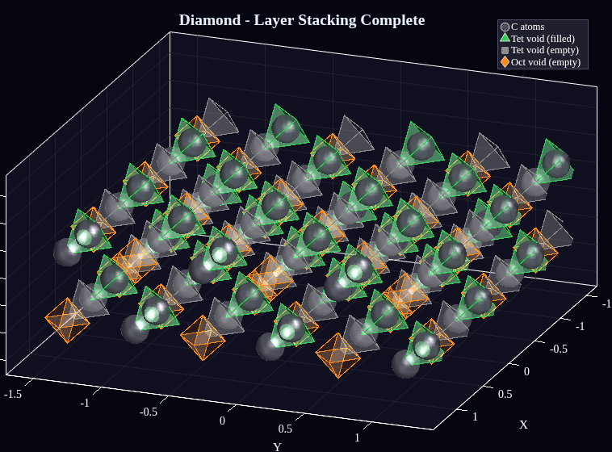

# Crystal Structure Visualization Tool - MATLAB | Materials Science Education

> **3D Crystal Structure Visualization Software for Materials Science, Crystallography, and Ceramic Engineering Education**

Interactive 3D visualization of crystal structures including FCC (Face-Centered Cubic), HCP (Hexagonal Close-Packed), and various ionic crystal structures with interstitial voids (octahedral and tetrahedral) and layer stacking animations. This MATLAB-based educational tool is designed for materials science students, crystallography researchers, and ceramic engineering professionals.

## Keywords
`crystal structure visualization` `MATLAB crystallography` `FCC unit cell` `HCP structure` `materials science education` `ceramic crystal structures` `interstitial voids` `octahedral voids` `tetrahedral voids` `ionic crystal visualization` `rock salt structure` `zinc blende` `fluorite structure` `perovskite structure` `spinel structure` `diamond cubic structure` `3D crystal animation` `layer stacking visualization` `unit cell MATLAB` `crystallography software`

## About This Project

This open-source MATLAB project provides comprehensive 3D visualization tools for understanding crystal structures commonly studied in:
- **Materials Science and Engineering** courses
- **Solid State Chemistry** and **Solid State Physics**
- **Crystallography** and **X-ray Diffraction** studies
- **Ceramic Engineering** and **Metallurgy**
- **Condensed Matter Physics** education

Perfect for students learning about Bravais lattices, close-packed structures, coordination numbers, packing efficiency, and interstitial sites in crystalline materials.

## Crystal Structure Screenshots and Visualizations

### FCC vs HCP Crystal Structure Comparison

*Side-by-side comparison of Face-Centered Cubic (FCC) ABCABC stacking vs Hexagonal Close-Packed (HCP) ABAB stacking sequence*

### FCC Unit Cell with Octahedral and Tetrahedral Voids

*Face-Centered Cubic unit cell showing octahedral void positions (red) and tetrahedral void positions (green)*

### Anti-Fluorite (Li2O) Crystal Structure Layer Stacking Animation

*Layer-by-layer visualization of Anti-Fluorite structure (Li2O) - Oxygen FCC sublattice with Lithium in all tetrahedral voids*

### Perovskite (CaTiO3) Crystal Structure Layer Stacking Animation

*Perovskite ABO3 structure visualization showing Ca, Ti, and O atomic positions*

### Diamond Cubic Crystal Structure Layer Stacking Animation

*Diamond cubic lattice showing carbon atoms in FCC arrangement with additional atoms in half of tetrahedral voids*

## MATLAB Source Code - Project Structure

This crystallography visualization toolkit is organized into four main modules:

```
Ceramics-project/
├── unitcell/                    # Static Unit Cell Visualizations with Interstitial Voids
│   ├── fcc_octahedral_voids.m   # FCC structure showing octahedral interstitial sites
│   ├── fcc_tetrahedral_voids.m  # FCC structure showing tetrahedral interstitial sites
│   ├── fcc_all_voids.m          # Complete FCC void visualization (oct + tet)
│   ├── hcp_octahedral_voids.m   # HCP structure showing octahedral interstitial sites
│   ├── hcp_tetrahedral_voids.m  # HCP structure showing tetrahedral interstitial sites
│   ├── hcp_all_voids.m          # Complete HCP void visualization (oct + tet)
│   └── fcc_hcp_comparison.m     # Side-by-side FCC vs HCP comparison
│
├── crystall_animation/          # Close-Packed Layer Stacking Animations
│   ├── fcc_animation.m          # FCC ABCABC stacking sequence animation
│   ├── hcp_animation.m          # HCP ABABAB stacking sequence animation
│   ├── fcc_hcp_comparison.m     # Static close-packed structure comparison
│   └── unit_cell_explorer.m     # Interactive 3D FCC unit cell explorer
│
├── new_crystals/                # Ionic Crystal Structure Visualizations
│   ├── rock_salt.m              # NaCl Rock Salt structure (Cl- FCC + Na+ in octahedral voids)
│   ├── zinc_blende.m            # ZnS Zinc Blende/Sphalerite structure (S2- FCC + Zn2+ in half tetrahedral voids)
│   ├── fluorite.m               # CaF2 Fluorite structure (Ca2+ FCC + F- in all tetrahedral voids)
│   ├── anti_fluorite.m          # Li2O Anti-Fluorite structure (O2- FCC + Li+ in all tetrahedral voids)
│   ├── perovskite.m             # CaTiO3 Perovskite ABO3 structure
│   ├── spinel.m                 # MgAl2O4 Spinel AB2O4 structure
│   └── diamond.m                # Diamond Cubic structure (C atoms in FCC + half tetrahedral voids)
│
├── other_crystall_animation/    # Ionic Crystal Layer Stacking Animations
│   ├── rock_salt_layers.m       # NaCl Rock Salt layer-by-layer stacking animation
│   ├── zinc_blende_layers.m     # ZnS Zinc Blende layer-by-layer stacking animation
│   ├── fluorite_layers.m        # CaF2 Fluorite layer-by-layer stacking animation
│   ├── anti_fluorite_layers.m   # Li2O Anti-Fluorite layer-by-layer stacking animation
│   ├── perovskite_layers.m      # CaTiO3 Perovskite layer-by-layer stacking animation
│   ├── spinel_layers.m          # MgAl2O4 Spinel layer-by-layer stacking animation
│   └── diamond_layers.m         # Diamond Cubic layer-by-layer stacking animation
│
├── assets/                      # Crystal structure screenshots and images
│
└── README.md
```

## System Requirements

- **MATLAB Version:** R2016b or later (tested on R2020a, R2021b, R2023a)
- **Toolboxes Required:** None - uses only core MATLAB functions
- **Operating System:** Windows, macOS, or Linux
- **Hardware:** Any system capable of running MATLAB with 3D graphics support

## Installation and Usage Guide

### How to Run Crystal Structure Visualizations

1. **Clone or download** this repository to your local machine
2. **Open MATLAB** and navigate to the project directory
3. **Choose a visualization module:**
   - `unitcell/` - For static unit cell visualizations with interstitial voids
   - `crystall_animation/` - For FCC/HCP layer stacking animations
   - `new_crystals/` - For ionic crystal structure visualizations
   - `other_crystall_animation/` - For ionic crystal layer animations
4. **Run any `.m` file** directly in MATLAB
5. **Interact with the 3D view** using mouse controls:
   - Left-click and drag to rotate
   - Scroll wheel to zoom
   - Right-click and drag to pan
6. **Close the figure window** to exit the visualization

## Crystal Structure Parameters - Crystallographic Data

### FCC (Face-Centered Cubic) Crystal Structure Properties

The Face-Centered Cubic (FCC) structure is one of the most common crystal structures found in metals. Also known as **cubic close-packed (CCP)** structure.

| Crystallographic Parameter | Value | Description |
|-----------|-------|-------------|
| Lattice Parameter | a | Edge length of cubic unit cell |
| Atoms per Unit Cell | 4 | (8 corners × 1/8) + (6 faces × 1/2) |
| Coordination Number (CN) | 12 | Number of nearest neighbors |
| Atomic Packing Factor (APF) | 74% | Maximum for spherical atoms |
| Stacking Sequence | ABCABC... | Three-layer repeat pattern |
| Octahedral Voids | 4 per unit cell | Located at body center and edge centers |
| Tetrahedral Voids | 8 per unit cell | Located at 1/4 positions |
| Example Metals | Cu, Al, Au, Ag, Ni, Pb, Pt, γ-Fe | Common FCC metals |

**FCC Atomic Positions (Fractional Coordinates):**
- 8 corner atoms: (0,0,0), (1,0,0), (0,1,0), (0,0,1), (1,1,0), (1,0,1), (0,1,1), (1,1,1)
- 6 face-center atoms: (½,½,0), (½,½,1), (½,0,½), (½,1,½), (0,½,½), (1,½,½)

### HCP (Hexagonal Close-Packed) Crystal Structure Properties

The Hexagonal Close-Packed (HCP) structure is another common close-packed arrangement with the same packing efficiency as FCC but different stacking sequence.

| Crystallographic Parameter | Value | Description |
|-----------|-------|-------------|
| Lattice Parameter a | a | Basal plane edge length |
| Lattice Parameter c | 1.633a (ideal) | Height of hexagonal prism |
| Ideal c/a Ratio | 1.633 (√(8/3)) | For perfect close-packing |
| Atoms per Unit Cell | 2 (primitive), 6 (hexagonal) | Depends on unit cell choice |
| Coordination Number (CN) | 12 | Same as FCC |
| Atomic Packing Factor (APF) | 74% | Same as FCC |
| Stacking Sequence | ABABAB... | Two-layer repeat pattern |
| Octahedral Voids | 2 per 2-atom basis | Between close-packed layers |
| Tetrahedral Voids | 4 per 2-atom basis | Between close-packed layers |
| Example Metals | Mg, Zn, Ti, Co, Cd, Zr, Be | Common HCP metals |

## Interstitial Voids in Close-Packed Structures

Understanding interstitial voids (octahedral and tetrahedral sites) is essential for studying:
- **Solid solutions** and **interstitial alloys** (e.g., carbon in iron for steel)
- **Ionic crystal structures** (cation positions in anion sublattices)
- **Diffusion mechanisms** in crystalline materials
- **Point defects** and **Frenkel defects**

### Octahedral Interstitial Voids (Coordination Number 6)

Octahedral voids are surrounded by 6 atoms arranged at the vertices of an octahedron.

| Property | FCC Structure | HCP Structure |
|----------|---------------|---------------|
| Number per unit cell | 4 | 2 per 2-atom basis |
| Critical radius ratio (r/R) | 0.414 | 0.414 |
| Coordination number | 6 atoms | 6 atoms |
| Location | Body center + 12 edge centers | Between close-packed layers |
| Size relative to atom | Larger than tetrahedral | Same as FCC |

**FCC Octahedral Void Positions (Fractional Coordinates):**
- Body center: (½, ½, ½)
- Edge centers: (½,0,0), (0,½,0), (0,0,½), (½,1,0), (1,½,0), (½,0,1), etc.

### Tetrahedral Interstitial Voids (Coordination Number 4)

Tetrahedral voids are surrounded by 4 atoms arranged at the vertices of a tetrahedron.

| Property | FCC Structure | HCP Structure |
|----------|---------------|---------------|
| Number per unit cell | 8 | 4 per 2-atom basis |
| Critical radius ratio (r/R) | 0.225 | 0.225 |
| Coordination number | 4 atoms | 4 atoms |
| Location | At ¼ and ¾ positions | Between close-packed layers |
| Size relative to atom | Smaller than octahedral | Same as FCC |

**FCC Tetrahedral Void Positions (Fractional Coordinates):**
- (¼, ¼, ¼), (¾, ¾, ¼), (¾, ¼, ¾), (¼, ¾, ¾)
- (¾, ¼, ¼), (¼, ¾, ¼), (¼, ¼, ¾), (¾, ¾, ¾)

## Color Coding

### Unit Cell Visualizations (unitcell/)

| Element | Color |
|---------|-------|
| Atoms | Blue (0.2, 0.4, 0.8) |
| Octahedral Voids | Red (0.9, 0.2, 0.2) |
| Tetrahedral Voids | Green (0.2, 0.8, 0.3) |
| Cell Edges | Dark Gray (0.3, 0.3, 0.3) |

### Animation Visualizations (crystall_animation/)

| Element | Color |
|---------|-------|
| Layer A atoms | Blue (0.2, 0.5, 1.0) |
| Layer B atoms | Red (1.0, 0.3, 0.3) |
| Layer C atoms | Green (0.3, 0.9, 0.4) |
| Octahedral Voids | Orange (1.0, 0.6, 0.0) |
| Tetrahedral Voids | Purple (0.9, 0.2, 0.9) |

## FCC vs HCP Crystal Structure Comparison

Understanding the differences between FCC and HCP is crucial for materials selection in engineering applications.

| Crystallographic Property | FCC (Face-Centered Cubic) | HCP (Hexagonal Close-Packed) |
|----------|-----|-----|
| Stacking Sequence | ABCABC (3-layer repeat) | ABABAB (2-layer repeat) |
| Unit Cell Geometry | Cubic | Hexagonal prism |
| Slip Systems | 12 (more ductile) | 3-6 (less ductile) |
| Crystal Symmetry | Higher (cubic) | Lower (hexagonal) |
| Atoms per Unit Cell | 4 | 2 (primitive) |
| Bravais Lattice | Face-centered cubic | Hexagonal |
| Point Group | m3m (Oh) | 6/mmm (D6h) |

**Identical Properties in Both Close-Packed Structures:**
- Atomic Packing Factor (APF): 74% - maximum for equal spheres
- Coordination Number (CN): 12 nearest neighbors
- Octahedral void radius ratio: r/R = 0.414
- Tetrahedral void radius ratio: r/R = 0.225

## Ionic Crystal Structures Visualized

This toolkit includes visualizations for common ionic crystal structures studied in ceramics and solid-state chemistry:

| Crystal Structure | Chemical Formula | Structure Description | Coordination |
|------------------|------------------|----------------------|--------------|
| **Rock Salt** | NaCl | Cl⁻ FCC + Na⁺ in all octahedral voids | 6:6 |
| **Zinc Blende** | ZnS (Sphalerite) | S²⁻ FCC + Zn²⁺ in half tetrahedral voids | 4:4 |
| **Fluorite** | CaF₂ | Ca²⁺ FCC + F⁻ in all tetrahedral voids | 8:4 |
| **Anti-Fluorite** | Li₂O, Na₂O | O²⁻ FCC + Li⁺/Na⁺ in all tetrahedral voids | 4:8 |
| **Perovskite** | CaTiO₃, BaTiO₃ | ABO₃ structure with corner-sharing octahedra | 12:6:6 |
| **Spinel** | MgAl₂O₄ | AB₂O₄ with mixed tetrahedral and octahedral sites | Complex |
| **Diamond Cubic** | C, Si, Ge | FCC + atoms in half tetrahedral voids | 4:4 |

## Crystallographic Formulas and Calculations

### Atomic Packing Factor (APF) Calculation

```
APF = (Volume of atoms in unit cell) / (Volume of unit cell)

For FCC:
APF = (4 × (4/3)πr³) / a³ = 0.74
where a = 2√2 r (lattice parameter relation to atomic radius)
```

### Critical Radius Ratio for Interstitial Voids

```
Octahedral void: r/R = √2 - 1 = 0.414
Tetrahedral void: r/R = √(3/2) - 1 = 0.225

where r = maximum interstitial atom radius
      R = host atom radius
```

### HCP Ideal c/a Ratio Derivation

```
c/a = √(8/3) = 1.633 (ideal close-packing)

Actual c/a ratios vary by material:
- Mg: 1.624 (close to ideal)
- Zn: 1.856 (elongated)
- Be: 1.568 (compressed)
```

## Features of This Crystal Visualization Software

### Interactive 3D Visualization
- **Mouse-controlled rotation** - Click and drag to explore structures from any angle
- **Zoom functionality** - Scroll to examine atomic arrangements in detail
- **Transparent atoms** - See through outer atoms to visualize internal void positions

### Educational Tools
- **Coordination polyhedra** - Octahedron and tetrahedron highlighting around voids
- **Layer-by-layer animations** - Watch close-packed planes stack sequentially
- **Side-by-side comparisons** - Compare FCC vs HCP structures simultaneously
- **Color-coded atoms and voids** - Easy identification of different atomic species

### Rendering Quality
- **Gouraud shading** - Smooth, realistic 3D rendering
- **High-resolution spheres** - Detailed atomic representation
- **Proper lighting** - Multiple light sources for depth perception

## Educational Applications

This crystal structure visualization tool is ideal for:

- **Undergraduate courses:** Introduction to Materials Science, Solid State Physics, Crystallography
- **Graduate studies:** Advanced ceramics, Phase transformations, Diffusion in solids
- **Self-study:** Preparing for exams (GATE, GRE Physics, Materials Science certifications)
- **Research presentations:** Creating figures for publications and presentations
- **Teaching demonstrations:** In-class visualization of crystal structures

## License and Citation

This is an open-source educational project. If you use these visualizations in your academic work, please cite this repository.

## Related Topics

Crystal structure, crystallography, materials science, MATLAB visualization, FCC structure, HCP structure, BCC structure, unit cell, lattice parameter, coordination number, packing efficiency, interstitial voids, octahedral sites, tetrahedral sites, ionic crystals, rock salt structure, zinc blende, fluorite, perovskite, spinel, diamond cubic, close-packed structures, stacking sequence, Bravais lattice, solid state physics, ceramic materials, metallurgy, crystalline materials, point defects, crystal symmetry
